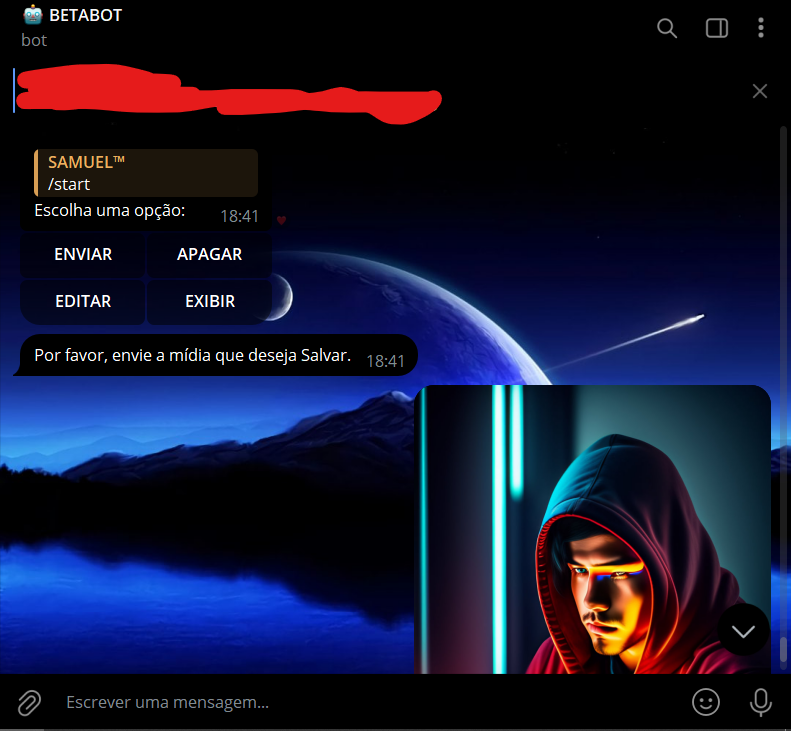
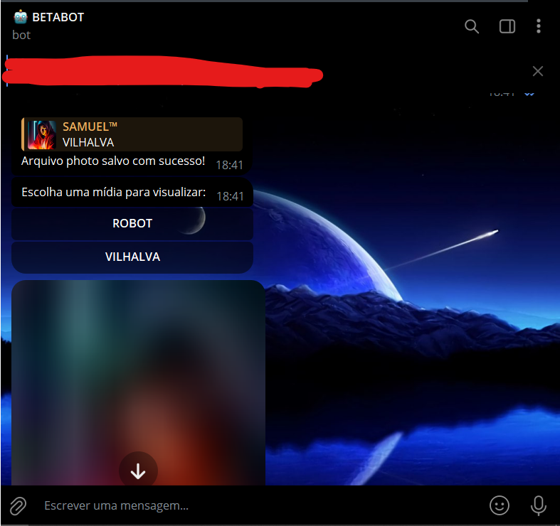
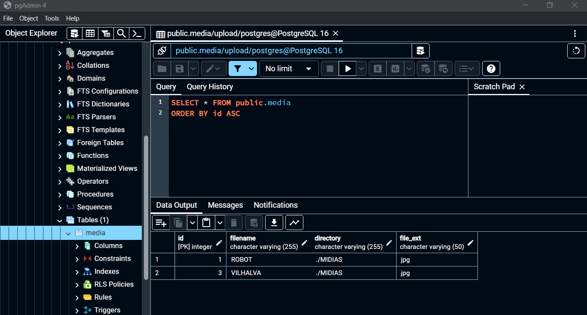
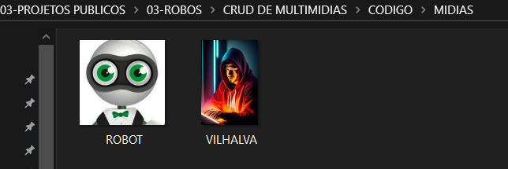

# CRUD DE MULTIMIDIAS BOT EM POSTGRESQL
🤤ESSE É UM BOT DO TELEGRAM DE CRUD DE MULTIMIDIAS EM POSTGRESQL!

 <br>
 <br>
 <br>
 <br>

## DESCRIÇÃO:
Este bot é um aplicativo de mensagens instantâneas que opera na plataforma Telegram e foi desenvolvido para gerenciar um banco de dados de multimídias. Ele oferece funcionalidades básicas de um CRUD (Create, Read, Update, Delete) para manipular arquivos de mídia, como imagens, vídeos ou áudios.

1. **Enviar Mídia:** Os usuários podem enviar arquivos de mídia para serem armazenados no banco de dados do bot. Isso é feito iniciando uma conversa com o bot e selecionando a opção "ENVIAR" no menu principal.

2. **Exibir Mídias:** Os usuários podem visualizar todas as mídias armazenadas no banco de dados do bot. Ao selecionar a opção "EXIBIR" no menu principal, o bot exibirá uma lista de todas as mídias disponíveis.

3. **Editar Mídia:** Os usuários podem renomear os arquivos de mídia armazenados no banco de dados. Ao selecionar a opção "EDITAR" no menu principal, o bot permite que os usuários escolham a mídia que desejam editar e forneçam um novo nome para ela.

4. **Apagar Mídia:** Os usuários podem excluir arquivos de mídia do banco de dados. Ao selecionar a opção "APAGAR" no menu principal, o bot exibe uma lista de todas as mídias disponíveis e permite que os usuários escolham qual deseja excluir.

O bot é capaz de interagir com os usuários por meio de mensagens de texto e botões interativos, facilitando a comunicação e a execução das operações CRUD de maneira intuitiva e eficiente. Ele ajuda os usuários a gerenciar suas coleções de mídia de forma conveniente e organizada diretamente do aplicativo Telegram.

## EXECUTANDO O PROJETO:
1. **Configuração do Banco de Dados:**
   - Antes de executar o bot, é necessário importar o arquivo `DATABASE.sql`.

2. **Editar o código:**
   - Certifique-se de substituir "localhost", "seu_usuario" e "sua_senha" no arquivo `DB_CONNECTION.py` pelas informações corretas do seu banco de dados POSTGRESQL.

3. **Instalando as dependências:**
   - Antes de executar o bot, certifique-se de instalar todas as dependências necessárias. No terminal, execute o seguinte comando para instalar as dependências listadas no arquivo `requirements.txt` em `CODIGO`:
   ```bash
   pip install -r requirements.txt
   ```

4. **Coloque o Token:**
   - Antes de executar o programa, é necessário substituir o token do seu bot no arquivo `TOKEN.py`, o qual pode ser obtido por meio do [@BotFather](https://t.me/BotFather).

5. **Inicie o Bot:**
   - Execute o bot do Telegram em Python iniciando-o com o seguinte comando:
   ```bash
   python MAIN.py
   ```
   
   - Inicie o bot enviando o comando `/start`. Receba uma mensagem de boas-vindas e clique nos botões inlines.

## NÃO SABE?
- Entendemos que para manipular arquivos em muitas linguagens e tecnologias relacionadas, é necessário possuir conhecimento nessas áreas. Para auxiliar nesse aprendizado, oferecemos alguns subsidios:
* [CURSO DE TELEBOT](https://github.com/VILHALVA/CURSO-DE-TELEBOT)
* [CURSO DE PYTHON](https://github.com/VILHALVA/CURSO-DE-PYTHON)
* [CURSO DE POSTGRESQL](https://github.com/VILHALVA/CURSO-DE-POSTGRESQL)
* [CONFIRA MAIS CURSOS](https://github.com/VILHALVA?tab=repositories&q=+topic:CURSO)

## CREDITOS:
- [PROJETO FEITO PELO VILHALVA](https://github.com/VILHALVA)
- [PROJETO BASEADO NO "CRUD DE MULTIMIDIAS BOT"](https://github.com/VILHALVA/CRUD-DE-MULTIMIDIAS-BOT)

